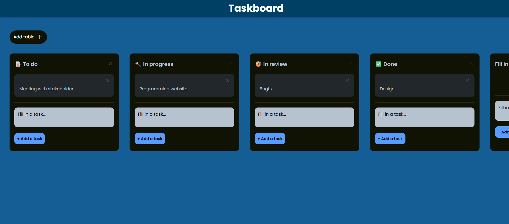

# 📝 Taskboard
I programmed with Vue a taskboard like Trello.

## 🛠️ Technologies

- Vue
- HTML
- CSS
- JavaScript

Unit test:
- Jest

CI/CD:
- This project uses GitHub Actions for continuous integration and continuous deployment (CI/CD)

Containerization:
- Docker

## 📷 Images

